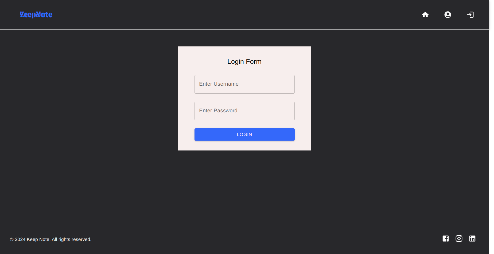
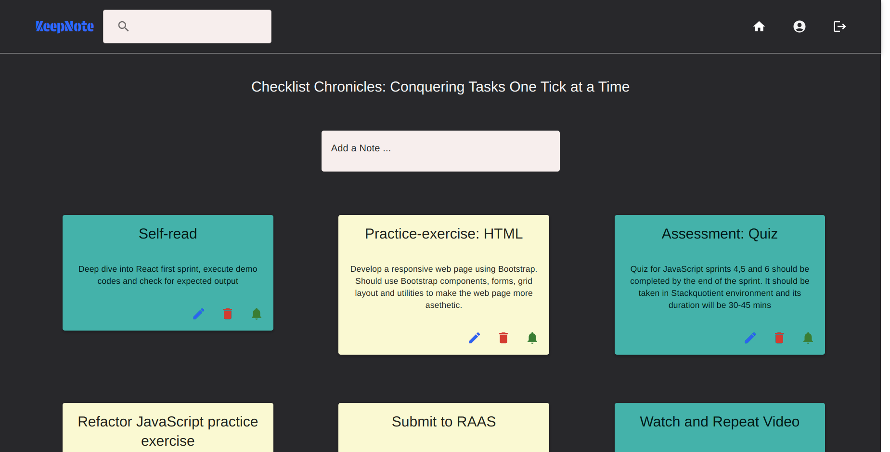
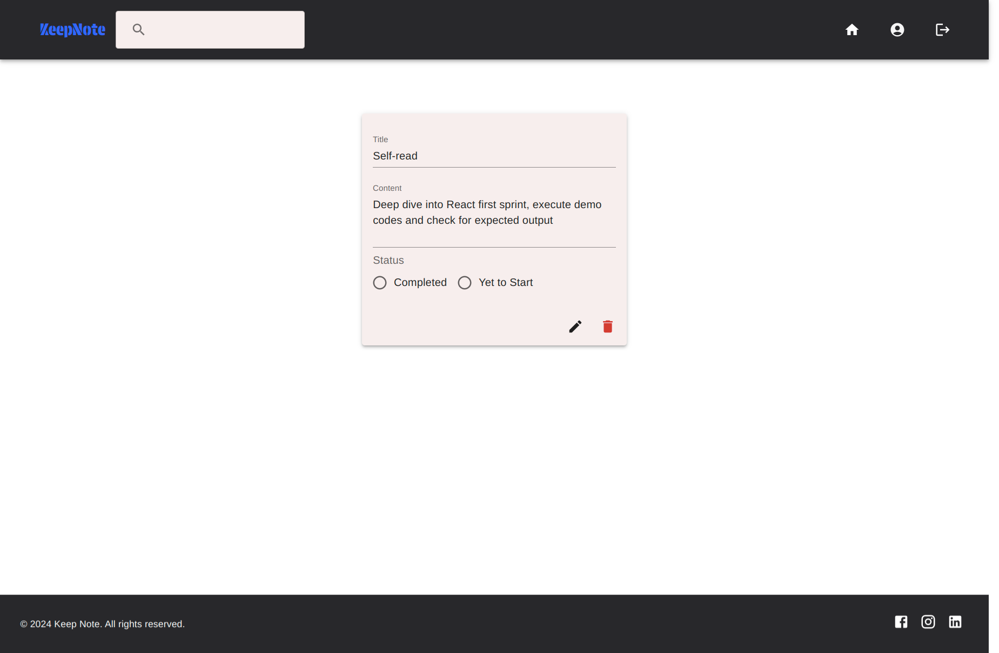
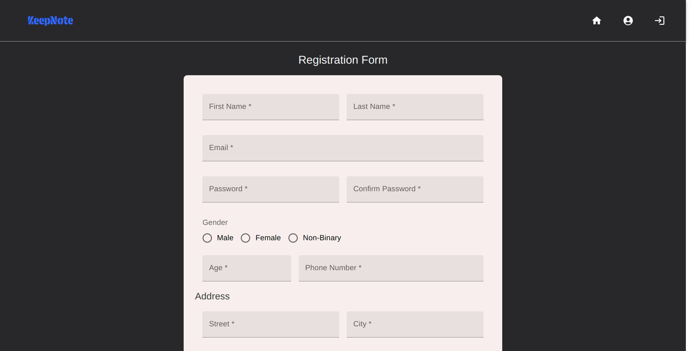

## Practice: Enable routing in the Keep-Note app using React router

## Context

As you are aware, Keep-Note is a web application that allows users to maintain notes. It is developed as a single-page application using multiple components.
​

#### The stages through which the development process will be carried out are shown below:

- Stage 1: Create basic Keep-Note application to view notes.​
- Stage 2: Manage state of React components to view and search notes.​
- Stage 3: Read data from remote server in the Keep-Note application.​
- Stage 4: Enable unit testing for the Keep-Note application.​
- Stage 5: Style the Keep-Note application using modern CSS techniques.​
- Stage 6: Develop an interactive form with validation to add new notes.​
- Stage 7: Build a complex form with validation in the Keep-Note application.​
- Stage 8: Style the Keep-Note application using Material design\*
- **Stage 9: Enable navigation in the Keep-Note application.**

In this sprint, we are at Stage 9.​​

In this stage, the Keep-Note application with multiple navigable views will be created that will allow the users to view, edit and delete notes.

## Problem Statement

Include the edit note and the delete note functionalities in the Keep-Note app to allow modification and deletion of the existing notes. Secure the app by implementing authentication logic within the app.​

​Enable routing in the Keep-Note app using React router.

### Task Details

Copy the solution of the Keep-Note application created for the `fe-c5-s4-material-design-practice` of the earlier sprint – `Style React Components Using Material Design System` - into the root folder.

Following are the tasks to complete this practice.​

#### Task 1: Define routes in the Keep-Note app​

In the App.js, define routes that fulfill the following requirements:​

- route that navigates to the notes view for the path `/notes`.​
- route that navigates to the edit-note view for the path `/notes/{id}`. ​
- the component rendering this view should read the id parameter from the route. It should then fetch the note by this id and display its details in editable mode.​
- route that navigates to the registration view for the path `/register`.​
- route that navigates to the login view for the path `/`.​
- wild card route to handle "page not found" error through the `PageNotFound` component.

#### Task 2: Add edit note functionality​

- Add a function handleEditNote() in the App component that makes a PUT request to update the note.​
- Create a React component NoteDetail that has input fields for note properties.​
- On initialization, the component should ​
  - Read the route parameter that contains id of the selected note.​
  - Fetch the note for the retrieved id.​
- Define a fucntion editNote() in the NoteDetail Component that updates the note with the changes provided by the user.​
  - Call the onEditNote() event handler prop by passing the updatedNote object.​
- Upon successful edit operation, the notes array should also be updated with the modified note using setState function.

#### Task 3: Add delete note functionality​

- Add a function `handleDeleteNote()` in the App component that makes a DELETE request to delete the selected note.​
- Each note card in the `NoteCard` component has a delete button which should handle the click event. The click event handler function should invoke the `onDeleteNote()` event handler prop to perform the delete operation.​
- Additionally, the `NoteDetail` component also has a delete button which should invoke the `onDeleteNote()` event handler prop to perform the delete operation.​
- Post deletion of note, the deleted note should also be removed from the array of notes and update the notes state using `setState` function.​

#### Task 4: Add routes to the keep-note application

The Keep-Note application launches the Header component by default. Rest of the components should be routed through the Header Component. ​

In different components of the Keep-Note application, do the following to add routes:​

- Identify the position in the application for dynamically loading the navigated component.​
- Add a link on the toolbar of the application to allow users to navigate to the register form view.​
- Add a link on the toolbar of the application to allow users to navigate to the login form view.​
- Add a link on the edit icon in the note card that allows users to navigate to the NoteDetail component.​
  - The route should contain `id` of the selected note for editing.

#### Task 5: Create AuthContext to store authentication status globally ​

- Create `AuthContext` to manage the authentication status.​
- Create authentication context provider – `AuthProvider` that manages the authentication state and provides functions for logging in and logging out.​
- Wrap the entire application(inside `index.js`) with the `AuthProvider` to make the authentication context available to all components.​
  - `AuthContext` can be consumed by all its child components and can access the authentication state and functions.

#### Task 6: Create LoginUser component to secure the app​

- Add a `LoginUser` Component that handles the following responsibilities:​
  - The login view should allow the users to enter their email and password as login credentials.​
  - Validate the login credentials using `validateUser()` function with some default values.​
- Once the user is successfully logged, it should ​
  - call the authentication function obtained from AuthContext to update the authentication status.​
  - navigate to notes view to display the notes​
- Display validation error message to the user if the login credentials are incorrect.

**Note: Ensure the login/logout icons in the Header component are toggled based on the authentication status.**

**Expected Output: Login Component**

#### Task 7: Implement programmatic navigation ​

- The Header component should contain a function called navigateToNotesView() that calls the `navigate()` function returned by the useNavigate hook.​
  - `navigatToNotesView()` should navigate to notes view if the user is already logged in, otherwise​
  - navigate to login view for the user to login​
- In the `NoteDetail` component, ​
  - once the note has been edited /deleted, call the function `navigate()` returned by the `useNavigate` hook to programmatically navigate to the notes view.

**Expected Output: Notes View**

**Expected Output: Note Edit view**

**Expected Output: Registration Form**

​
